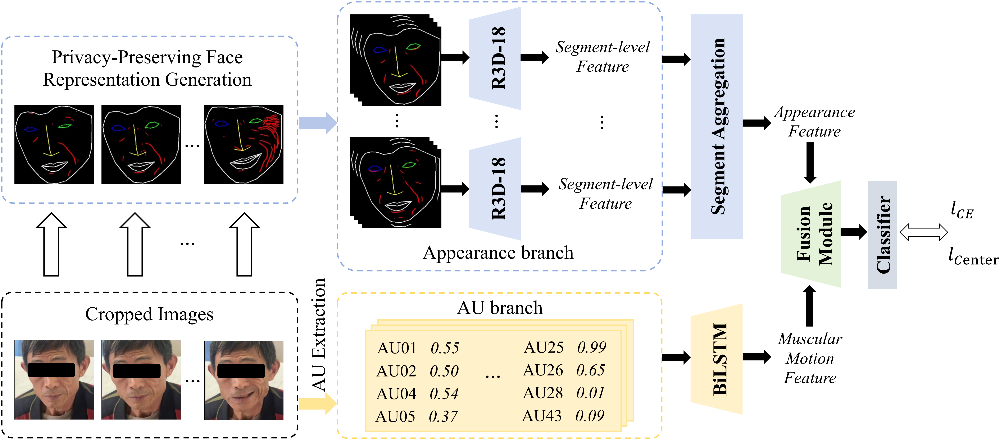
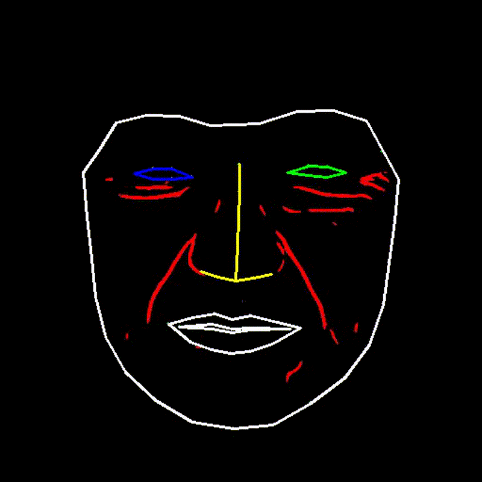
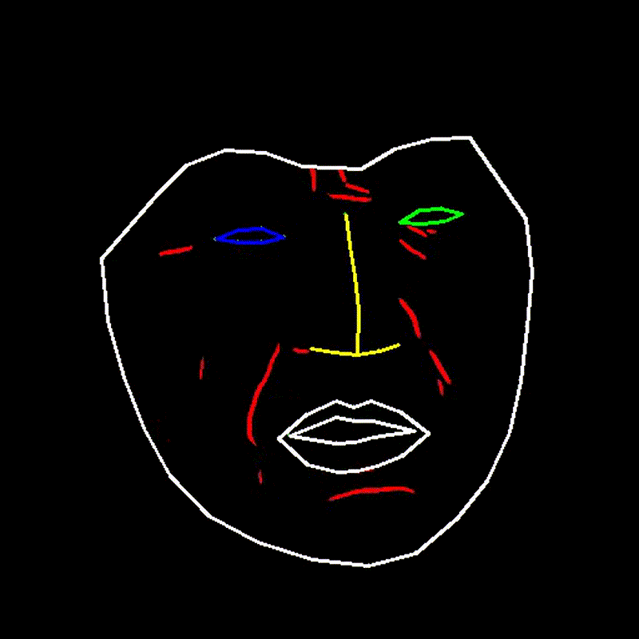

# DP-Face

Official code for the paper: **"Privacy-Preserving Video-Based Facial Palsy Recognition via Dynamic Facial Action Modeling"**

> **MICCAI 2026**

## Authors

**Yuance Chang<sup>1</sup>, Bang Liu<sup>1</sup>, Han Ding<sup>1*</sup>, Cui Zhao<sup>1</sup>, Fei Wang<sup>1</sup>, Ge Wang<sup>1</sup>, Wei Xi<sup>1</sup>**

<sup>1</sup> Xi'an Jiaotong University, Xi'an, China

## Abstract

DP-Face is a video-based framework for automatically detecting facial palsy, designed to protect patient privacy by avoiding the use of raw facial images.  
Instead of RGB appearance, it captures dynamic facial asymmetry using landmarks, wrinkle patterns, and Action Unit–based muscle movements.  
To facilitate reproducible research, we release **Palsy-330**, currently the largest public video dataset for facial palsy, with 330 subjects. Evaluated under a patient-independent protocol, DP-Face outperforms existing baselines and shows promise for rapid stroke screening, especially in remote or resource-limited settings.



## Dataset

**Palsy-330** contains 330 subjects (210 Palsy, 120 Normal) collected from multiple hospitals. Each subject provides a video clip recorded under standardized conditions, with frames extracted at 224×224 resolution. Patient metadata includes gender, age, and hospital source.

See [DP-dataset/README.md](./DP-dataset/README.md) for details.

## Data Preparation

Download [Palsy-330](https://pan.baidu.com/s/1tUpvrToivws9mSsGXN-S4w?pwd=cwc7) and extract to `DP-face/DP-dataset`:

```
DP-dataset/
├── Clip/
│   └── clip_224x224/
│       └── landmark_overlay/
│           ├── Palsy/
│           └── Normal/
└── patient_metadata.csv
```

## Visualization
Here are examples of normal and palsy faces. <br>
Example videos can be found in `figs/Normal.mp4` and `figs/Palsy.mp4`.

<div style="display: flex; justify-content: space-between;">
  
  
</div>

## Installation

```
pip install -r requirements.txt
```

## Training

```
python main.py --root ./DP-dataset --savename base1
```

### Command-Line Arguments

| Argument | Default | Description |
|----------|---------|-------------|
| `--root` | `./DP-dataset` | Path to the dataset root folder |
| `--savename` | `""` | Name for saving results and checkpoints |
| `--epochs` | `100` | Number of training epochs |
| `--batch_size` | `32` | Batch size |
| `--lr` | `5e-4` | Learning rate |
| `--fusionmodel` | `Base` | Model architecture (`Base` or `M3DFEL_AUs_FiLM_center_loss`) |
| `--AUs` | `False` | Use Action Unit features |
| `--center_loss` | `True` | Use center loss |
| `--seed` | `42` | Random seed for reproducibility |

## Acknowledgement

Part of the code is borrowed from [SZU-AdvTech-2023/278-Rethinking-the-Learning-Paradigm-for-Dynamic-Facial-Expression-Recognition](https://github.com/SZU-AdvTech-2023/278-Rethinking-the-Learning-Paradigm-for-Dynamic-Facial-Expression-Recognition).

## Contact

For questions, contact: greenthunder@stu.xjtu.edu.cn
